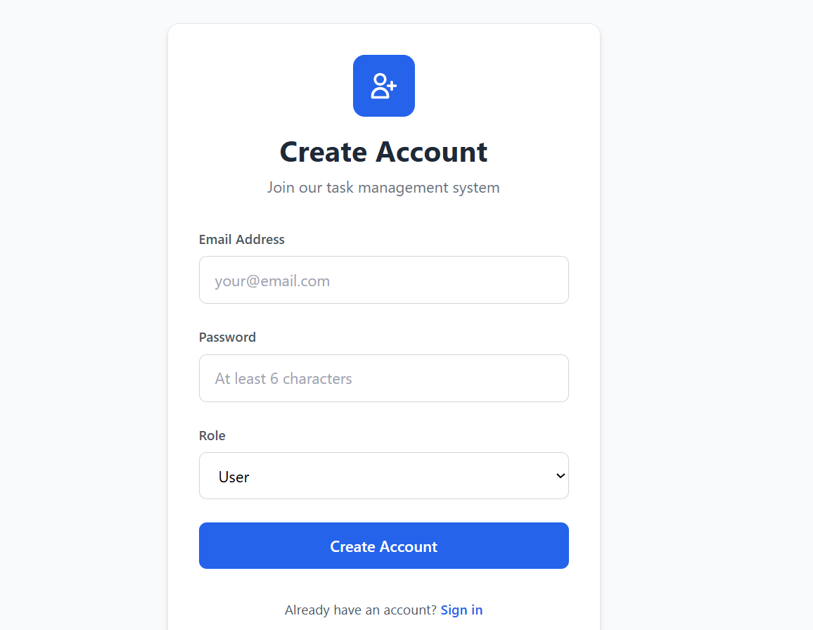
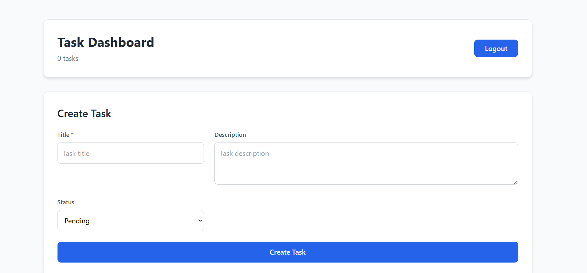

# Task Management System

A full-stack **Task Management Application** built using **React, Node.js, Express, and MongoDB** with **JWT Authentication** and **Swagger API documentation**.

Users can register, login, and manage tasks securely.

---

# Features

* User Authentication (JWT)
* Role-based access (Admin/User)
* Create tasks
* Update tasks
* Delete tasks
* View all tasks
* Protected routes
* API documentation using Swagger
* RESTful API design

---

# Tech Stack

Frontend

* React.js
* Tailwind CSS
* Axios

Backend

* Node.js
* Express.js
* MongoDB
* Mongoose

Authentication

* JWT

Documentation

* Swagger

---

# Project Structure

```
project-root
│
├── backend
│   ├── controllers
│   ├── routes
│   ├── middleware
│   ├── models
│   ├── config
│   └── server.js
│
├── frontend
│   ├── src
│   ├── components
│   └── package.json
│
├── README.md
└── .gitignore
```

---

# Installation

Clone the repository

```
git clone https://github.com/Dhairyatiwari7/Primetrade.ai-task.git
```

Go into project directory

```
cd Primetrade.ai-task
```

---

# Backend Setup

```
cd backend
npm install
```

Create `.env` file

```
PORT=5000
MONGO_URI=your_mongodb_connection
JWT_SECRET=your_secret_key
```

Run backend server

```
npm start
```

Server runs at

```
http://localhost:5000
```

---

# Frontend Setup

```
cd frontend
npm install
npm run dev
```

Frontend runs at

```
http://localhost:3000
```

---

# API Documentation

Swagger documentation available at:

```
http://localhost:5000/api-docs
```

You can test APIs directly from Swagger UI.

---

# API Endpoints

Auth APIs

```
POST /api/v1/auth/register
POST /api/v1/auth/login
```

Task APIs

```
GET /api/v1/tasks
POST /api/v1/tasks
GET /api/v1/tasks/:id
PUT /api/v1/tasks/:id
DELETE /api/v1/tasks/:id
```

---

# Screenshots

# Screenshots

## Login Page


## Dashboard


---

# Future Improvements

* Task filtering
* Search functionality
* Pagination
* Notifications
* Dark mode

---

# Author

Dhairya Tiwari

GitHub:
https://github.com/Dhairyatiwari7
